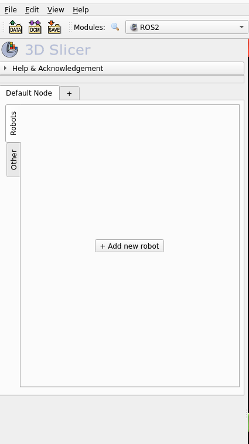
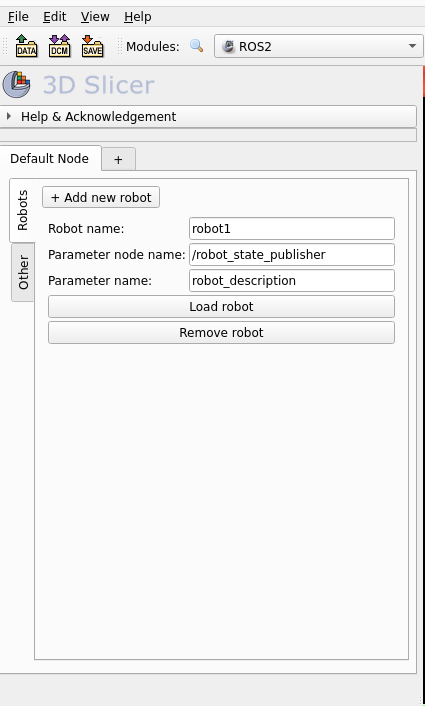

# Setting up SlicerROS2

Refer to the [SlicerROS2 documentation](https://slicer-ros2.readthedocs.io/en/latest/index.html) for more information.

## Build and run the container

```bash
docker build -t slicerros .
docker run -it -v /tmp/.X11-unix:/tmp/.X11-unix -e DISPLAY=$DISPLAY slicerros
```

From the interactive terminal (tilix is installed in the container by default so you can run it to have multiple terminal tabs
and panes), you can run the following commands:

## Run 3D Slicer and ROS2 nodes

### In one terminal, run 3D Slicer:

```bash
slicer
```

#### Note

The first time you run Slicer, you need to add the SlicerROS2 module directory (~ros2_ws/build/ROS2/lib/Slicer-5.6/qt-loadable-modules)
in the Application Settings (Edit > Application Settings > Modules > Additional module paths > Add). Then restart Slicer.

### In another terminal, launch the franka_bringup node:

```bash
s_ros # source the ROS2 environment (`/opt/ros/humble/setup.bash` and `/home/medcvr/ros2_ws/install/setup.bash`)
ros2 launch franka_bringup franka.launch.py
```

### In another terminal, run the joint_state_publisher node:

```bash
s_ros # source the ROS2 environment (`/opt/ros/humble/setup.bash` and `/home/medcvr/ros2_ws/install/setup.bash`)
ros2 run franka_bringup fake_joints
```

### In 3D Slicer

Load the ROS2 module (Menubar > Modules search icon > Search for "ROS2" and select it).

You should see the following:



Click "+ Add new robot". You should see the following:



Click "Load robot" and you should see the robot model in the 3D view.


<details>
<summary>Details and Manual Setup</summary>

The Dockerfile sets up a development environment for ROS2 and 3D Slicer. You can
replicate this environment by running the following instructions:

Note that this has been tested with Ubuntu 22.04 and ROS2 Humble.

- Install ROS2 Humble. See the [ROS2 installation instructions](https://docs.ros.org/en/humble/Installation.html).
- Next, install 3D Slicer. You have to build it from source to use the [SlicerROS2](https://slicer-ros2.readthedocs.io/en/latest/index.html) module.
    See the [3D Slicer installation instructions](https://slicer.readthedocs.io/en/latest/developer_guide/build_instructions/linux.html).
    - After cloning the 3D Slicer repository, run the following commands:
        ```bash
        cd Slicer && git checkout v5.6.2
        cd .. && mkdir Slicer-SuperBuild-Debug
        cd Slicer-SuperBuild-Debug
        cmake -DSlicer_USE_SYSTEM_OpenSSL=ON -DSlicer_BUILD_TESTING=OFF -DSlicer_DOWNLOAD_TEST_DATA=OFF -DSlicer_USE_TESTING_DATA=OFF -DBUILD_TESTING=OFF ../Slicer
        make -j<number_of_cores>
        ```
- Next, create a ROS2 workspace (`ros2_ws`)
    ```bash
    mkdir -p ros2_ws/src
    ```
- In the `ros2_ws/src` directory, clone the [SlicerROS2](https://github.com/rosmed/slicer_ros2_module) repository
    and build the ROS2 workspace.
    ```bash
    cd ros2_ws/src
    git clone https://github.com/rosmed/slicer_ros2_module
    cd ..
    colcon build --cmake-args -DSlicer_DIR:PATH=<path_to_Slicer-SuperBuild-Debug>/Slicer-build -DCMAKE_BUILD_TYPE=Release
    ```
- In the `ros2_ws/src` directory, clone the [franka_bringup](https://mcsgitlab.utm.utoronto.ca/iseoluwa/franka_bringup.git)
    and [franka_description](https://mcsgitlab.utm.utoronto.ca/iseoluwa/franka_description.git) repositories
    and build the ROS2 workspace.
    ```bash
    cd ros2_ws/src
    git clone https://mcsgitlab.utm.utoronto.ca/iseoluwa/franka_bringup.git
    git clone https://mcsgitlab.utm.utoronto.ca/iseoluwa/franka_description.git
    cd ..
    colcon build
    ```
- For convenience, add the following aliases to your `.bashrc` file:
    ```bash
    alias s_ros="source /opt/ros/humble/setup.bash && source /home/medcvr/ros2_ws/install/setup.bash"
    alias slicer="s_ros && /home/medcvr/slicer/Slicer-SuperBuild-Debug/Slicer-build/Slicer"
    ```

Now you can run Slicer and the ROS2 nodes locally.

</details>
